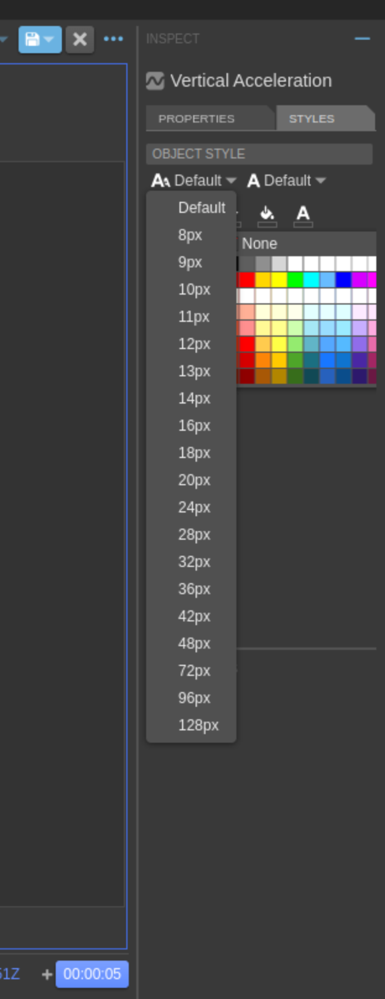

<div style="text-align: center;">
    
</div>

#

<div style="text-align: center;">
    
    
    

</div>

#


   


<br/><br/>

# EX-UI
EX-UI is a collection of code components enabling sleek and simple real-time monitoring and control of rocket launches and tests. It was conceptualized in January 2022 as a means to replace the hitherto used software LabView, which became increasingly unsuitable to manage modern rocketry scenarios.

A thesis laying the foundation for EX-UI was written in 2022. It explains all background information including motivation behind EX-UI and key principles used to conceptualize it. It can be found here:

[Development of a Web-Based SCADA System for Rocket Launches and Tests](resources/Thesis.pdf)

A concise summary of EX-UI's core concepts can be found [here](resources/EX-UI_Summary.pdf).

# Table of Contents
- [EX-UI](#ex-ui)
- [Table of Contents](#table-of-contents)
- [Capabilities and Screenshots](#capabilities-and-screenshots)
- [Usage](#usage)
  - [Installation](#installation)
  - [Equipment Configuration](#equipment-configuration)
  - [Start](#start)
  - [UI Configuration](#ui-configuration)
- [Development](#development)
  - [Repository Structure](#repository-structure)
  - [Git Principles](#git-principles)
  - [Git Workflow](#git-workflow)
    - [Adding External Libraries](#adding-external-libraries)
    - [Cloning for Development](#cloning-for-development)
    - [Updating External Libraries](#updating-external-libraries)
    - [General Recommended Development Workflow](#general-recommended-development-workflow)
  - [Development Principles](#development-principles)
  - [Adding an OpenMCT plugin](#adding-an-openmct-plugin)
- [Important Concepts](#important-concepts)
  - [Web Based Software](#web-based-software)
  - [OpenMCT](#openmct)
  - [Adapters](#adapters)
  - [Docker Compose and Swarm](#docker-compose-and-swarm)


# Capabilities and Screenshots

If you want to check out the UI capabilities of EX-UI, a good point to start is by checking out the live-demo of the unmodified version of OpenMCT:

[OpenMCT Live Demo](https://openmct-demo.herokuapp.com/)

<details>
  <summary>Graphical User Interface for Starting</summary>
  EX-UI is started with `start.py`, a python start script using Pyside6 to show trusty dialogs:

  <p float="left">
    
    
  </p>
</details>

<details>
  <summary>Custom UI Creation</summary>
  Any of the visualization capabilities mentioned in this README-chapter can be arranged in custom overview pages using flexible layouts or display layouts:

  

  Additionally, many visualizations support customization of colors, font size/style and more themselves:

  <p float="left">
    
    
  </p>
</details>

<details>
  <summary>Real Time Plots</summary>
  Plots can display up to 20 measurements a second in real time. Time axis range can be customized, as well as y-axis range, autorange, interpolation, data point styling, colors and more.

  
  
</details>

<details>
  <summary>Maps</summary>
  IN DEVELOPMENT AFTER PROOF OF CONCEPT  
  
  If the equipment configuration contains gps data points, embedded webpages are automatically created showing a map visualizing the gps coordinates:

  

  Polygons can be visualized on the map as well e.g. for visualization of signal strength:

  
</details>

<details>
  <summary>3D Terrain</summary>
  IN DEVELOPMENT AFTER PROOF OF CONCEPT

  GPS data points defined in the equipment configuration can be visualized in 3D as well using three-geo:

  
</details>

<details>
  <summary>3D Orientation in Real Time</summary>
  IN DEVELOPMENT
  Using three.js, orientation of spacecraft can be visualized in real time. This visualization adapter is still in early stage development, a demo can be seen [here](https://streamable.com/79msuf) as well as [here](https://streamable.com/ivmgfz).
</details>

<details>
  <summary>Live Video Integration</summary>
  Using WebRTC, RTSP streams can be integrated with very low latency. WARR Rocketry testing achieved 168 ms latency on a full HD stream.

    
</details>

<details>
  <summary>Computer Monitoring</summary>
  General Purpose Computers can be monitored using NetData.

  
</details>

<details>
  <summary>OPC UA Integration</summary>
  IN IMPROVEMENT STAGE  

  OPC UA servers can be queried for their object tree structure and automatically parsed into the domain object tree of OpenMCT using the opcua adapter. This allows to integrate DAQs into EX-UI without having to specify its channels in the equipment configuration.
</details>

<details>
  <summary>TCP Integration</summary>
  TCP socket servers can be integrated using the tcp adapter. This has been proven to work with a serial device server hosting a connection to a serial flight computer. The tcp adapter automatically reconnects after connection loss.
</details>
<details>
  <summary>APRS Integration</summary>
  IN DEVELOPMENT AFTER PROOF OF CONCEPT

  APRS data packets can be integrated using the APRS adapter. If the APRS packet contains GPS, the adapter supplies a GPS data point for location visualizations over a websocket. It uses UDP on the other end.
</details>
<br/><br/>

# Usage
## Installation
1. Ensure git is installed
2. Clone this repository  
3. Ensure Python 3 is installed
4. Run `install.py` on every computer you want to participate in load sharing (see [Docker Compose and Swarm](#docker-compose-and-swarm))
## Equipment Configuration
The equipment configuration is a JSON file describing all data and control sinks of the system of interest. It further describes their single data points and control endpoints. Check out the example [here](config/eq_example.json) or expand the section below to learn more.

<details>
  <summary>How to Specify Data Sources and Control Sinks</summary>

</details>

## Start
1. Run `start.py`
2. Access website in the browser: `http://IP.of.any.swarm-computer:8080`
## UI Configuration
The UI configuration file is a JSON file describing how data points and control sinks were arranged in visualizations in OpenMCT. Together with the equipment configuration file it represents one of the MOST IMPORTANT user-centric files for EX-UI. After creating a UI in OpenMCT, it can be stored by right-clicking on its containing folder and choosing "Export to JSON" in the context menu. It can be reimported by choosing the "Import from JSON" option.  
The UI configuration file is not intended for manual edits.

# Development
## Repository Structure
Folder / File           | Description
:----------------------:|:---------------------:
adapters/               | Contains all adapters (see [Adapters](##adapters))
config/                 | Intended for storage of equipment and UI config files (See [UI Configuration](##ui-configuration) and [Equipment Configuration](##equipment-configuration))
plugins/                | Contains custom OpenMCT plugins
resources/              | Contains general images, documents and more
webserver/              | Contains WARR Rocketry's customized version of OpenMCTs web stack (See [Web Based Software](##web-based-software)).
install.py              | Installation script for EX-UI
start.py                | Start Script for EX-UI


## Git Principles
- **Holy Main Branch:** Main branch has to be a confirmed working version of EX-UI at all times. This is to avoid having to scramble together a working version of the software off of somewhere for urgent tests or launch scenarios.
- **Merging Branch:** As a consequence of above point, no branch is ever merged directly into main, but through the merging branch instead. If you want to merge a branch into main this means: 1. Merge into merging, 2. Confirm merging branch works, 3. Merge into main
- **Feature Branches:** To add a feature or capability to EX-UI, a new branch should be created
- **Subtree Merging Strategy:** If this repository is to be expanded with external libraries, it needs to be done using the [subtree merging strategy](https://docs.github.com/en/get-started/using-git/about-git-subtree-merges). This ensures incorporated libraries can be modified, updated and are actually part of this repository's code (e.g. when cloning).

## Git Workflow
### Adding External Libraries
Use the subtree merging strategy described [here](https://docs.github.com/en/get-started/using-git/about-git-subtree-merges). DO NOT use git submodules as they cannot be modified easily if the library is not made by us.  
Important: After cloning this repositroy, you need to add all remotes manually for the external libraries if you want to update them for example (See [Cloning for Development](###cloning-for-development))
### Cloning for Development
You should use ssh to clone, fetch, pull etc., setting up ssh is described [here](https://docs.gitlab.com/ee/user/ssh.html).  
Because this repository uses the subtree merging strategy for external libraries, it is important that you add remotes for them manually after cloning, IF you intend to update them or need any other access to their source:  
`git remote add -f <Remote Name> <Library Source URL e.g. from GitHub>`

### Updating External Libraries
Again, refer to the subtree merging strategy described [here](https://docs.github.com/en/get-started/using-git/about-git-subtree-merges). The command to use is:  
`git pull -s subtree <library remote name> <branchname used when library was added>`

### General Recommended Development Workflow
1. Create new feature branch:

    ```sh
    git checkout main
    git pull
    git checkout -b feature/my_feature
    touch my_file
    git add my_file
    git commit -m "Add new file"
    git push --set-upstream origin feature/my_feature
    ```

2. Create Merge Request with `Draft:` prefix

    - Go to the [repo](https://gitlab.lrz.de/matti.ukkola/networks) in your browser

    

    - Target branch: `main`, Source branch: `<your branch>`
    - Add `Draft:` in front of your MR name
    - Save

3. Make changes
4. Rebase (more often == better)

    ```sh
    git checkout feature/my_feature
    git fetch
    git rebase origin/main
    git push -f
    ```

5. Remove `Draft:`
6. Get approvals
7. Final rebase
8. Merge in browser


## Development Principles
EX-UI is to be developed following these core principles:
- **One-Click-Philosophy:** After Installing, EX-UI must require only one "click" or "action" to be started up. Configuration of EX-UI, for a specific teststand for example, does not count into this.
- **Color Connotation:** Green colors are positively connotated, yellow colors negatively and red colors even more so.
- **Intuitiveness:** As much of EX-UI is to be designed so that it can be understood intuitively. This applies to this repository, the UI and everything else. UI elements for control should be able to visually represent the real controlled device.
- **Reliability and Dependability:** EX-UI must work reliably and be developed to be dependable. Dependability means the same as that EX-UI can be trusted by its users in this context. Think about how to increase trust when developing.

## Adding an OpenMCT plugin
The process of adding a plugin to OpenMCT is as follows:
1. Add a folder for the plugin code into ./plugins/OpenMCT/
2. Register the plugin in ./webserver/src/plugins/plugins.js
3. Install the plugin in ./webserver/index.html (if desired)
4. Add the plugins folder in the webserver to the .gitignore, otherwise it will be in the repo twice

# Important Concepts
## Web Based Software
**Definition**  
Web-Based software runs in the web browser. As such, it can be considered a website or
web application (Terms can and will be used interchangeably). It cannot run outside the en-
vironment of the browser. Hence, its code does not run directly on a computer like native
computer programs, but on the additional layer of the browser.

**The Browser Environment**  
The browser can be considered an entire operating system specifically targeted towards
delivery of web applications. It loads website code and runs it in a constrained and standardized environment. This is what enables the Internet as it is known today, where websites can
be used on practically any device with a browser. As such, browsers can be considered a
tool for simple, widespread distribution of software.
The vast majority of modern browsers are able to run JavaScript code, which is almost exlu-
sively used to program websites today.
The browser environment specifies a suite of APIs, often called Web APIs. This suite can
vary slightly inbetween browsers. Chrome, for example supports direct access to serial devices connected to a devices USB port, while Firefox does not. These APIs can be
used by the website loaded into the browser and as such, a large part of them are JavaScript
based APIs.

**Browser Networking**  
Because browsers are such a constrained environment, there are only a handful of ways for
websites to communicate with endpoints outside it. To begin with, browsers only support
one protocol to communicate with "the outside world". It is the HTTP protocol, which is used
to load a website when a user requests it through the browsers address bar. This is why
browsers are also often called HTTP clients. Any additional modes of communication are
specified by the browsers web APIs.
When a user requests a website with an address, the browser requests an "index.html" file
from the server corresponding to that address. Servers like this are called web servers,
because they supply the website content to the browser. The websites’ index, describes
all of the content on the website, including JavaScript code, images, text and more. After
loading the index, the browser loads those contents from the web server as well. Web servers
can be considered the backend of a web application, the website code as the frontend.
As soon as the website code is loaded into the browser, it can use the browsers web APIs
to establish connections itself. There are only a handful of web APIs that enable additional
communication with servers. The most relevant ones are depicted in section 3.1. The web
application developed in this thesis will make heavy use of web sockets, for instance.


**Web Stacks**  
The collection of all code components, across the front- and the backend, used to realize a
web application is called the web stack. In general, web stacks can be categorized in the
following, going from the frontend to the backend:  
Frontend:
- Website Styling: Cascading Stylesheets (CSS), Syntactically Awesome Stylesheets (SASS)
, . . .
- UI Framework: VueJS, React, . . .
- Website Code(or Runtime): JavaScript, TypeScript, . . .  

Backend:
- Web Server: Express, Django, PHP, . . .
- Database: InfluxDB, ChouchDB, . . .
- Module Bundler: WebPack, rollup, . . .
- Server Runtime: NodeJS, Python, . . .
- Deployment: Docker, Kubernetes, . . .

A crucial aspect of any JavaScript based website, is that it runs in the JavaScript runtime
environment of the browser, which is fundamentally single-threaded and event-based . To
illustrate: A while-loop in the websites' JavaScript code without an exit condition, will block
the single thread it is running in. This effectively stops any further code from being run,
causes instable behavior in the browser or even crashes it. This is why in the JavaScript
runtime, any code portion that might exhibit such a behaviour, like a websocket waiting for
data, is deferred to the so called "event loop" of the browsers JavaScript runtime. The runtime
will not be further explained here, but [this](https://medium.com/@gemma.croad/understanding-the-javascript-runtime-environment-4dd8f52f6fca) and [this](https://www.codecademy.com/article/introduction-to-javascript-runtime-environments) detail it further.

## OpenMCT
OpenMCT (Open Mission Control Technologies), as described on its website, is an open
source, "next-generation mission control framework for visualization of data" and can be used
"as the basis for building applications for planning, operation, and analysis of any systems
producing telemetry data"[42].

It is being developed by NASA’s Ames Research Center in collaboration with NASA’s AM-
MOS-team and the Jet Propulsion Laboratory since 20141 [43]. It was created to satisfy the
"rapidly evolving needs of mission control systems" including "distributed operations, access
to data anywhere [...] and flexible reconfiguration to support multiple missions and operator
use cases"[42].

The OpenMCT Git repository can be found under https://github.com/nasa/openmct where
it is being released under version 2.0 of the Apache License. The repository can be used di-
rectly, because it includes an entire web stack. A documentation overview can be found on
the OpenMCT homepage [44]. Additionally, there is an outdated developer guide available
[45] and a relatively up to date user guide [46].
OpenMCT was chosen over other solutions like COSMOS from Ball Aerospace [47] or more
general frameworks like GTK (Gimp-Toolkit) [48] or Kivy [49], due to its maturity and relatively
good documentation. It also offered one of the best visual appearances out of the box and
it is actively maintained. Furthermore, it is closely oriented towards the applications it will be
used for in this thesis and its web-based nature enables expansion for multi-user scenarious
in the future. Lastly, there exists a host of communication libraries for its server-side runtime
environment, NodeJS, that can be used to communicate with equipment in the target plane
of the SCADA system.

To use OpenMCT for a project it is mainly modularly expanded via plugins (in the frontend!).
As its code is publically available, it can be modified directly as well. The decision for Open-
MCT impacts development on EX-UI across the front- and the backend. OpenMCT’s web
stack was adopted one-to-one for EX-UI:


OpenMCT offers a variety of configurable data visualizations out of the box. A few of the most
relevant ones for applications in rocketry are listed below.
- Overlay Plots (multiple data series in one plot; Supports single data series)
- Stacked Plots (multiple data series constrained to horizontal sections of one plot)
- Bar Plots
- Tables
- Display Layouts (configurable positioning of multiple visualizations)
- Flexible Layout (Automatic sizing and positioning of multiple visualizations)
- Tab Views (Contained views accessable via clickable tabs)
- Web Pages

Colors are customizable in most visualization types and some, like plots, additionally offer individualization of interpolation, data point geometry, (automatic) y-axis range, and more. Full-
and multi screen setups are supported natively. Multiple browser tabs can be used to display
different visualizations, the tabs can be distributed over multiple screens. A demonstration of
OpenMCT can be accessed publicly [here](openmct-demo.herokuapp.com/).

## Adapters
To integrate devices of the SCADA systems I/O plane into EX-UI, intermediary code on the
server side is needed to map their interfaces to an interface browsers support. Code that only
translates commands and data between interfaces like this will be called adapter from now
on, akin to physical adapters used for cable connectors. The web API of choice for external
communication for EX-UI are websockets, but there is also the option to integrate devices by embedding a completely separate website. To integrate the TCP based secondary flight
computer described in listing 3.1 for example, an adapter would be needed that has a TCP
client on one side and a websocket server on the other.


## Docker Compose and Swarm
Docker can be considered a deployment tool for software. It is open source and at its core,
it supplies a consistent environment for software to be installed and run in across multiple
platforms. The environments that can be created with docker are called containers. To define
a container for a specific software, a dockerfile has to be created describing its installation
process and start command. This way, the software can be installed on any computer that
has docker and access to the internet by using only its dockerfile. Docker also ensures that
containers are automatically started on computer startup.

**Docker Compose**  
Docker can be expanded with docker compose, an additional tool facilitating installation and
connection of multiple docker containers. To use it, a "docker-compose.yaml" file has to
be created, listing container amount and names, their dockerfile locations, networks, ports,
restart policies and more. This way, with a single command, "docker compose up", multiple
software components can be installed and run. Noteably, how and if docker is supposed to
restart containers on an (unexpected) exit can be defined. This has potential to increase
dependability.

**Docker Swarm**  
As with compose, docker can be expanded with swarm. Swarm enables control over software
deployment on any number of computers called nodes. As long as a computer has docker
installed, it can be added to the swarm either as a manager node or a worker node. Manager
nodes are in charge of maintaining the softwares XX optimal state. Crucially, they can redis-
tribute containers to other nodes, in case one fails. Which containers are preferred to be run-
ning on which nodes can be specified in the "docker-compose.yaml" file. For instance, video
transcoding containers could be preferably distributed to nodes that have powerful graphics
cards.

It is important to note that no setup is necessary on the nodes except installing docker and
adding them to the swarm. Docker automatically distributes the docker files to the containers,
which can then subsequently use them to install their software component. Again, only a
single command is necessary to install and run the software on all computers: "docker stack
deploy".

**Swarm Networking Concepts**  
At the point where containers are programmaticly distributed over multiple computers with
different IP addresses, a user cannot know for certain which IP address to use to access a
desired container. To solve this, docker swarm uses a mechanism called the ingress net-
work, which automatically forwards requests for a specific container to the computer it is
running on.
For communication between containers, a so called overlay network can be defined, stretch-
ing over all containers that need to communicate with each other.

Applying the docker concepts to EX-UI yields the following conclusions:
- Each adapter and the web server become a docker container
- Adapters and the web server are their own separate software components, each contain-
ing their own docker file.
- EX-UI with all its components is defined through a docker-compose.yaml file
- Every computer that is intended to run part of EX-UI requires docker and needs to be
added to the docker swarm
- All components needed to make EX-UI work are distributed, installed and run on multiple
computers by the docker stack deploy command


